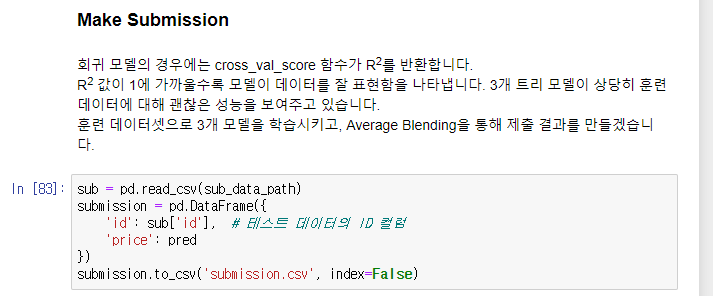
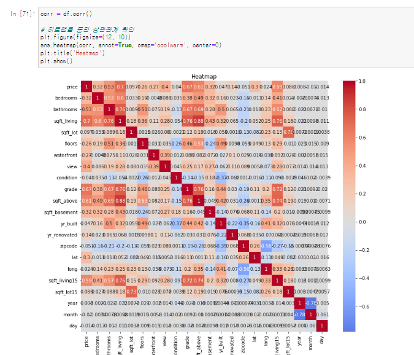
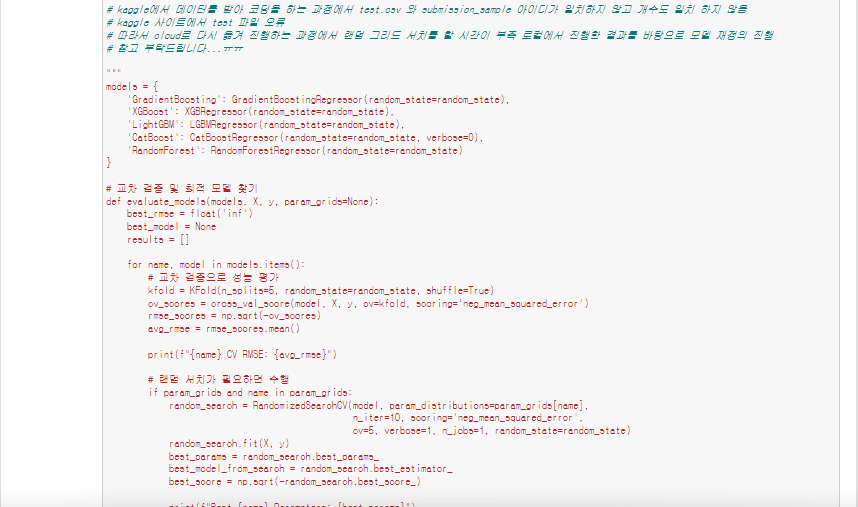

# AIFFEL Campus Online Code Peer Review Templete
- 코더 : 김종환
- 리뷰어 : 서승환


# PRT(Peer Review Template)
- [O]  **1. 주어진 문제를 해결하는 완성된 코드가 제출되었나요?**



    - 넵 모델을 학습후 예측값을 submission.csv 파일로 만들었습니다!
    
- [O]  **2. 전체 코드에서 가장 핵심적이거나 가장 복잡하고 이해하기 어려운 부분에 작성된 
주석 또는 doc string을 보고 해당 코드가 잘 이해되었나요?**



    - 히트맵을 이용해 컬럼들의 상관관계를 학인해 전처리 하는 부분이 인상 깊었습니다! 저는 생각지도 못했거든요ㅠ

- [O]  **3. 에러가 난 부분을 디버깅하여 문제를 해결한 기록을 남겼거나
새로운 시도 또는 추가 실험을 수행해봤나요?**



    - test.csv파일이 갯수가 달라 다시 하는 과정에서 시간이 부족해 주석처리한 부분이 있었습니다
        
- [O]  **4. 회고를 잘 작성했나요?**
    - 프로젝트가 괜찮은 성능을 보여주고 있다는 회고 부분이 눈에 띄네요!
        
- [O]  **5. 코드가 간결하고 효율적인가요?**
    - 간결하고, 필요한 부분만 코딩한 것 같습니다


# 회고(참고 링크 및 코드 개선)
```
# 리뷰어의 회고를 작성합니다.
# 코드 리뷰 시 참고한 링크가 있다면 링크와 간략한 설명을 첨부합니다.
# 코드 리뷰를 통해 개선한 코드가 있다면 코드와 간략한 설명을 첨부합니다.

저도 다음번에는 히트맵을 사용해 상관관계를 파악 해보도록 하겠습니다!

```
